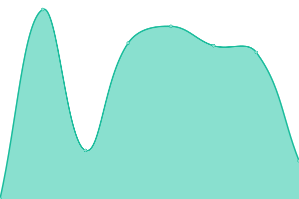

# [📈 Live Status](https://status.terraisles.com): <!--live status--> **🟧 Partial outage**

This repository contains the open-source uptime monitor and status page for [Tecwizard](https://status.terraisles.com), powered by [Upptime](https://github.com/upptime/upptime).

With [Upptime](https://upptime.js.org), you can get your own unlimited and free uptime monitor and status page, powered entirely by a GitHub repository. We use [Issues](https://github.com/Tecwizard/TRP-Status/issues) as incident reports, [Actions](https://github.com/Tecwizard/TRP-Status/actions) as uptime monitors, and [Pages](https://status.terraisles.com) for the status page.

<!--start: status pages-->
<!-- This summary is generated by Upptime (https://github.com/upptime/upptime) -->
<!-- Do not edit this manually, your changes will be overwritten -->
<!-- prettier-ignore -->
| URL | Status | History | Response Time | Uptime |
| --- | ------ | ------- | ------------- | ------ |
|  [Terra Isles Website](https://www.terraisles.com) | 🟩 Up | [terra-isles-website.yml](https://github.com/Tecwizard/TRP-Status/commits/HEAD/history/terra-isles-website.yml) | 

 634ms
     
 | 

<a href="https://status.terraisles.com/history/terra-isles-website">100.00%</a>
    

|  [TeamSpeak Server](http://ts3.terraisles.com) | 🟥 Down | [team-speak-server.yml](https://github.com/Tecwizard/TRP-Status/commits/HEAD/history/team-speak-server.yml) | 

 0ms
     
 | 

<a href="https://status.terraisles.com/history/team-speak-server">4.97%</a>
    

|  [FiveM Server](https://fivem.terraisles.com:32024) | 🟥 Down | [five-m-server.yml](https://github.com/Tecwizard/TRP-Status/commits/HEAD/history/five-m-server.yml) | 

 0ms
     
 | 

<a href="https://status.terraisles.com/history/five-m-server">2.27%</a>
    

|  [Iceburg Server](https://fivem.terraisles.com/) | 🟥 Down | [iceburg-server.yml](https://github.com/Tecwizard/TRP-Status/commits/HEAD/history/iceburg-server.yml) | 

 0ms
     
 | 

<a href="https://status.terraisles.com/history/iceburg-server">6.19%</a>
    

|  [Arma Server](games1.madzahttr.com:2302) | 🟥 Down | [arma-server.yml](https://github.com/Tecwizard/TRP-Status/commits/HEAD/history/arma-server.yml) | 

 0ms
     
 | 

<a href="https://status.terraisles.com/history/arma-server">2.71%</a>
    

<!--end: status pages-->

[**Visit our status website →**](https://status.terraisles.com)

## 📄 License

- Powered by: [Upptime](https://github.com/upptime/upptime)
- Code: [MIT](./LICENSE) © [Tecwizard](https://status.terraisles.com)
- Data in the `./history` directory: [Open Database License](https://opendatacommons.org/licenses/odbl/1-0/)
